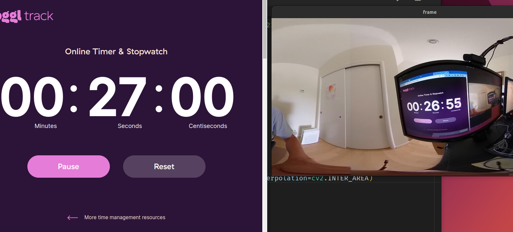

# Software Requirements

## Basic Software for Live Streaming

You need to download the two GitHub repos below and
compile the driver and sample code.

* [libuvc-theta](https://github.com/ricohapi/libuvc-theta)
* [libuvc-theta-sample](https://github.com/ricohapi/libuvc-theta-sample)

If you want to use `/dev/video0`, you will also need

* [v4l2loopback](https://github.com/umlaeute/v4l2loopback)

In addition, there are numerous dependencies to compile
the tools listed above.  However, have no fear, we will
walk you through it.

## Using gstreamer and OpenCV without v4l2loopback

v4l2loopback add complexity and latency.  If your objective is to use
OpenCV, consider using [gstthetauvc](https://github.com/nickel110/gstthetauvc) instead.

### How To Compile and Install Software

* [Build and install on x86 Ubuntu 20.04](https://youtu.be/Ji4WDvPHzQk)
* [Jetson Nano with OpenCV and VLC on /dev/video0](https://youtu.be/1xUMOvO_X5E)
* [Compile libuvc-theta on Jetson Nano - silent screencast](https://youtu.be/GoYi1tSIV80)
* [Build and run v4l2loopback on Jetson Nano](https://youtu.be/KrKwUWSYp2U). Needed for `/dev/video0`

## Getting Stream on /dev/video0

Steps:

1. compile and install [libuvc-theta](https://github.com/ricohapi/libuvc-theta)
2. compile and install [libuvc-theta-sample](https://github.com/ricohapi/libuvc-theta-sample)
3. compile and install [v4l2loopack](https://github.com/umlaeute/v4l2loopback)
4. run `gst_loopback` from `libuvc-theta-sample`
5. access the correct video device with OpenCV or any video 4 Linux 2 application such as VLC.  The video device is
[specified in the source code](https://github.com/ricohapi/libuvc-theta-sample/blob/f8c3caa32bf996b29c741827bd552be605e3e2e2/gst/gst_viewer.c#L190).

### Compile and Install v4l2loopback

```text
git clone https://github.com/umlaeute/v4l2loopback.git
cd v4l2loopback
make 
sudo make install
sudo depmod -a
```

### Load and use

This assumes that you have adjusted the video device in
`gst_viewer.c`.

```text
$ sudo modprobe v4l2loopback
$ cd path_to_gst_loopback_directory
$ ./gst_loopback
$ cvlc v4l2:///dev/video2
VLC media player 3.0.9.2 Vetinari (revision 3.0.9.2-0-gd4c1aefe4d)
[0000556fc2bd6db0] dummy interface: using the dummy interface module...
```

#### How to Load v4l2loopback automatically

In the file `/etc/modules-load.d/modules.conf` add a new line `v4l2loopback`.

```text
$ pwd
/etc/modules-load.d
craig@jetson:/etc/modules-load.d$ cat modules.conf 
# /etc/modules: kernel modules to load at boot time.
#
# This file contains the names of kernel modules that should be loaded
# at boot time, one per line. Lines beginning with "#" are ignored.

# bluedroid_pm, supporting module for bluetooth
bluedroid_pm
# modules for camera HAL
nvhost_vi
# nvgpu module
nvgpu

# for RICOH THETA live streaming
# v4l2loopback device on /dev/video0. specify in gst_viewer.c
v4l2loopback

craig@jetson:/etc/modules-load.d$ 
```

#### Check kernel module load

```text
$ lsmod
Module                  Size  Used by
bnep                   16562  2
zram                   26166  4
overlay                48691  0
spidev                 13282  0
v4l2loopback           37383  0
nvgpu                1579891  18
bluedroid_pm           13912  0
ip_tables              19441  0
x_tables               28951  1 ip_tables
craig@jetson:/etc/modules-load.d$ 
```

## v4l2loopback tests and examples

### gst-launch-1.0 pipeline

```text
$ gst-launch-1.0 v4l2src device=/dev/video2 ! video/x-raw,framerate=30/1 ! xvimagesink
Setting pipeline to PAUSED ...
Pipeline is live and does not need PREROLL ...
Setting pipeline to PLAYING ...
New clock: GstSystemClock
```


### VLC command line example

```text
$ cvlc v4l2:///dev/video2
VLC media player 3.0.9.2 Vetinari (revision 3.0.9.2-0-gd4c1aefe4d)
[000055573aea4db0] dummy interface: using the dummy interface module...
```


### Use v4l2-ctl to get video device output

I’ve modified the source to stream 2K video.

```text
$ v4l2-ctl --list-formats-ext --device  /dev/video2
ioctl: VIDIOC_ENUM_FMT
	Type: Video Capture

	[0]: 'YU12' (Planar YUV 4:2:0)
		Size: Discrete 1920x960
			Interval: Discrete 0.033s (30.000 fps)
```

## Using gstthetauvc to eliminate v4l2loopback

gstthetauvc is an alternative to using libuvc-theta-sample with v4l2loopack. 
In these example, there is no `/dev/video*`.  To get the stream into OpenCV,
set `VideoCapture` to the pipeline as shown in the examples below.

The plug-in is installed in `/usr/lib/x86_64-linux-gnu/gstreamer-1.0`.


Latency is about 360ms latency and the stream is stable.


### Display thetauvcsrc to monitor with gst-launch-1.0

This example is using hardware acceleration on x86 with NVIDIA card with
Linux NVIDIA driver 510.

```text
gst-launch-1.0 thetauvcsrc mode=4K \
  ! queue \
  ! h264parse \
  ! nvdec \
  ! queue \
  ! glimagesink sync=false 
```


### Using gstthetauvc with OpenCV

```python
import cv2
# pipeline below worked
# cap = cv2.VideoCapture("thetauvcsrc \
#     ! decodebin \
#     ! autovideoconvert \
#     ! video/x-raw,format=BGRx \
#     ! queue ! videoconvert \
#     ! video/x-raw,format=BGR ! queue ! appsink")

# pipeline suggestion thanks to nickel110
# attempt to force hardware acceleration
# tested with NVIDIA 510.73 with old GTX 950 on Ubuntu 22.04
cap = cv2.VideoCapture("thetauvcsrc \
    ! queue \
    ! h264parse \
    ! nvdec \
    ! gldownload \
    ! queue \
    ! videoconvert n-threads=0 \
    ! video/x-raw,format=BGR \
    ! queue \
    ! appsink")

if not cap.isOpened():
    raise IOError('Cannot open RICOH THETA')

while True:
    ret, frame = cap.read()
    frame = cv2.resize(frame, None, fx=0.25, fy=0.25, interpolation=cv2.INTER_AREA)
    cv2.imshow('frame', frame)


    c = cv2.waitKey(1)
    if c == 27:
        break

cap.release()
cv2.destroyAllWindows()
```



## USB API

* [libptp](https://sourceforge.net/projects/libptp/) - next section for detailed walkthrough
