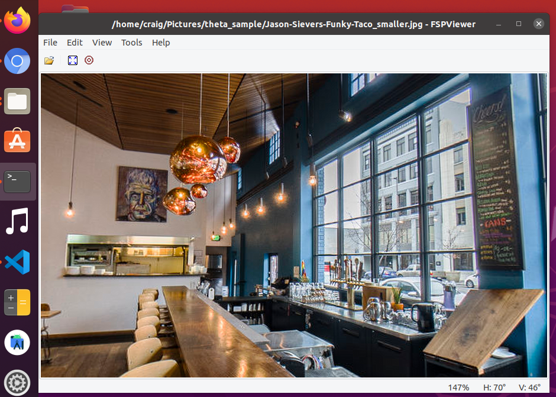

# Image Viewer

[FSPViewer](https://www.fsoft.it/FSPViewer/) is a free tool to view 360 images from the camera.

It is comparable to the RICOH THETA desktop application viewer.

## Installation

* [Download](https://www.fsoft.it/FSPViewer/download/)

You may see the following error.

```text
FSPViewer-2.1.0-64$ ./FSPViewer64 
./FSPViewer64: error while loading shared libraries: libpng12.so.0: cannot open shared object file: No such file or directory
```

You can get the required libpng12.so.0 library from linuxuprising.

```
sudo add-apt-repository ppa:linuxuprising/libpng12
sudo apt update
sudo apt install libpng12-0
```

## Usage

Drag and drop file onto FSPViewer

