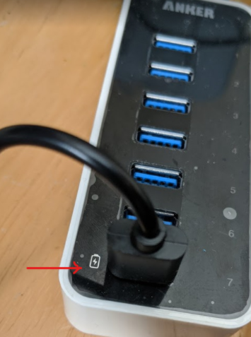

You need a THETA V or Z1.  These cameras live stream
with UVC 1.5 in equirectangular.
You can also use a THETA S to stream motionJPEG in dual-fisheye.

## Streaming Specifications

V and Z1 USB streaming.

* 4K，H264: 3840×1920/29.97fps/120Mbps
* 2K，H264: 1920×960/29.97fps/42Mbps

The modes for the sample program 
are specified in [thetauvc.c](https://github.com/ricohapi/libuvc-theta-sample/blob/f8c3caa32bf996b29c741827bd552be605e3e2e2/gst/thetauvc.c#L55).

You can specify the resolution in [gst_viewer.c](https://github.com/ricohapi/libuvc-theta-sample/blob/f8c3caa32bf996b29c741827bd552be605e3e2e2/gst/gst_viewer.c#L248).  An example of changing the resolution is [here](https://github.com/codetricity/libuvc-theta-sample).


## Long-Term Streaming

With firmware 1.60.1 or newer, the Z1 can stream indefinitely.
The battery will charge when streaming at 4K.  To stream indefinitely,
you need the proper equipment.  After testing streaming on 5 different
computers, I could only achieve continuous non-stop streaming on one computer.

From our community tests, it appears that the USB 3.0 (or 3.1, 3.2) port needs
to support Battery Charging 1.2 or equivalent.  The Z1 consumes 0.6Amp to 0.9Amps while
streaming 4K.  Without a powered hub, the Raspberry Pi and Jetson Nano cannot
stream indefinitely.

I tested an old [Anker 7-Port USB 3.0 hub](https://www.anker.com/products/variant/7-port-usb-30-hub-/A7505112)
that I had on my desk with a Jetson Nano.
The Z1 battery charged increased while it was streaming at 4K.  The Z1 camera body
remained comfortably warm when I touched it, not hot.

In the test setup below, the Anker USB hub is plugged into a power strip. The hub is above
my keyboard.


The hub that I am using only has one port that is BC 1.2 compliant.  I needed to use
the BC 1.2 port. 



If I plugged the Z1 into the other 6 ports, the camera would only consume 0.440 Amps.
This is the same electrical current consumption that I saw on the USB 3.1 and 3.2 ports
of the computers I tested.  With the Z1 drawing 0.440 Amps, the battery will drain during streaming.

Using the BC 1.2 port, the camera draws up to 0.8 Amps to 0.9 Amps while charging and streaming.


After the camera passes 90 percent charge, the charging rate appears to slow down. After a long
4K streaming session on the Nano, the Z1 is staying happy at 95 percent charge.


## Sleep and Power Overview

The camera has three power states:

1. Power off
2. Power on
3. Sleep

You can use the THETA API over a USB cable to control power off, sleep, and awake.
To turn on the camera from power off, you can use a C library to power cycle the
USB ports on a small board computer such as a Jetson Nano. This is an unofficial
community workaround and is not supported by RICOH.


| Function | Method |
| -------- | ------ |
| Sleep    | USB API |
| Awake    | USB API |
| Power Off | USB API |
| Power On | workaround with C library |

## Sleep and Wake

If your application can provide power to the
THETA or if the THETA does not have to be dormant for a long time, it is better to use
sleep and awake. You can use the USB API to control sleep and awake. 

We used the following process to test sleep and awake:

1. [Disable auto power off delay](usb_api.md#auto-power-off-delay) and disable auto sleep - you only need to do this once.
The camera will save the setting.
2. [Put camera to sleep](usb_api.md#put-camera-to-sleep)
3. [Wake camera from sleep](usb_api.md#wake-camera-from-sleep)
4. Check if camera status is ready. If the camera is still asleep, send the wake camera again.

If you do not have any problems waking the camera up from sleep on the first attempt, you may not need step 4.

## Power Off and Power On

If you require power off and power on for applications such as placing the THETA on 
a robot, then shipping the robot to another site, you can use a Nano 
or Raspberry Pi to power on the THETA.


### Turn Camera Off

The camera can be turned off with the USB API.

```
$ ptpcam -R 0x1013
```

### Turn Camera On Using Jetson Nano

There is no official way to turn on the camera once it is in a power off state.
We recommend that you use sleep and awake.  If this is not an option,
you can turn the camera on by power cycling the USB ports of the Jetson Nano.

This example uses libusb.

#### Sample Code for Jetson Nano

```c
/**************** 
* Tested on Jetson Nano running JetPack 4.4
* The RICOH THETA V and Z1 will turn on from a power off state when 
* the USB cable is plugged into a port. This example  will power cycle
* the USB ports of the Nano.  You must have libusb-1.0-0-dev installed
* on the Nano and link to it.
* 
* Additional information on using libusb_control_transfer is below. 
* https://www.cs.unm.edu/~hjelmn/libusb_hotplug_api/group__syncio.html
*****************/

#include <stdio.h>
#include <string.h>
#include <stdlib.h>
#include <stdint.h>
#include <unistd.h>
#include <libusb-1.0/libusb.h>

unsigned		vid = 0x0bda;
unsigned		pid = 0x5411;


int power_cycle(libusb_device_handle *hub_devh)
{
        int ret = -1;

        /*ep0 vendor command enable*/
        ret = libusb_control_transfer(hub_devh, 0x40, 0x02, 0x01, ((0x0B<<8)|(0xDA)), 0, 0, 100000);
        if (ret < 0) {
                printf("[error]:ep0 vendor command enable fail.\n");
                return ret;
        }

        /*ep0 vendor command disable*/
        libusb_control_transfer(hub_devh, 0x40, 0x1, 0x08, 0, NULL, 0, 100);
        libusb_control_transfer(hub_devh, 0x40, 0x3, 0x08, 0, NULL, 0, 100);
        libusb_control_transfer(hub_devh, 0x40, 0x02, 0x00, ((0x0B<<8)|(0xDA)), 0, 0, 100000);

        return ret;
}

int main(int argc, char *argv[])
{
    int ret=0;
    libusb_device_handle	*hub_devh;
    libusb_context		*context;

    ret = libusb_init(&context);
    if (ret != 0){
        printf("[error]:libusb init fail.\n");
        return ret;
    }
    
    hub_devh = libusb_open_device_with_vid_pid(context, vid, pid);
    if (!hub_devh) {
        printf("[error]:open device %04x:%04x fail.\n", vid, pid);
		return -1;
	}
    ret = power_cycle(hub_devh);
    return ret;
}
```

You can test the code by first saving the code in a file called, 
`reset_jetson_usb_power.c` then follow these steps:


```bash
$ sudo apt-get install libusb-1.0-0-dev
$ gcc -o power_cycle reset_jetson_usb_power.c -lusb-1.0
$ sudo ./power_cycle
```

### Turn Camera On Using Raspberry Pi

#### install libusb-dev

`sudo apt-get install libusb-dev`

#### install hub-ctrl.c

`git clone https://github.com/codetricity/hub-ctrl.c`

* make and then install in `/usr/local/bin`

#### create shell script to cycle power

Save the following into `/usr/local/sbin/cycle-power.sh`.

```bash
#!/bin/bash
/usr/local/bin/hub-ctrl -h 0 -P 2 -p 0 
sleep 2
/usr/local/bin/hub-ctrl -h 0 -P 2 -p 1
```

#### Optional - Enable script to run without sudo password

This is a potential security risk.  If you want to avoid having to enter
a password and are comfortable with the risk, then follow the steps
in [this article](https://askubuntu.com/questions/155791/how-do-i-sudo-a-command-in-a-script-without-being-asked-for-a-password).


#### Additional Tips for Raspberry Pi 4

Thanks to Shun Yamashita of [fulldepth](https://fulldepth.co.jp/) for this solution
to cycle the power on the Raspberry Pi 4 USB ports, which has the effect of turning
the THETA Z1 on when it is plugged in with a USB cable. 

Shun reported that with the Raspberry Pi 4, the script above did not work.  He wrote
the script below for the RPi 4 which does work.

```bash
#!/bin/bash

ptpcam -R 0x1013

/usr/local/bin/hub-ctrl -h 0 -P 1 -p 0
/usr/local/bin/hub-ctrl -h 0 -P 2 -p 0
/usr/local/bin/hub-ctrl -h 0 -P 3 -p 0
/usr/local/bin/hub-ctrl -h 0 -P 4 -p 0
/usr/local/bin/hub-ctrl -h 1 -P 1 -p 0
/usr/local/bin/hub-ctrl -h 1 -P 2 -p 0
/usr/local/bin/hub-ctrl -h 1 -P 3 -p 0
/usr/local/bin/hub-ctrl -h 1 -P 4 -p 0
/usr/local/bin/hub-ctrl -v

sleep 5

/usr/local/bin/hub-ctrl -h 0 -P 1 -p 1
/usr/local/bin/hub-ctrl -h 0 -P 2 -p 1
/usr/local/bin/hub-ctrl -h 0 -P 3 -p 1
/usr/local/bin/hub-ctrl -h 0 -P 4 -p 1
/usr/local/bin/hub-ctrl -h 1 -P 1 -p 1
/usr/local/bin/hub-ctrl -h 1 -P 2 -p 1
/usr/local/bin/hub-ctrl -h 1 -P 3 -p 1
/usr/local/bin/hub-ctrl -h 1 -P 4 -p 1
/usr/local/bin/hub-ctrl -v
```