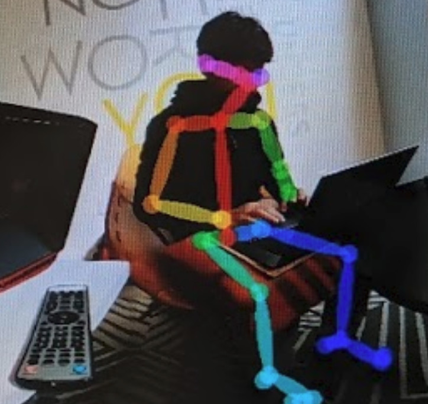
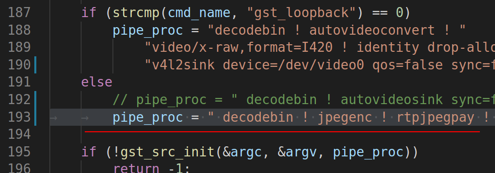

## Ongoing Tests with Linux Streaming


Using Nvidia Jetson Nano live streaming from a THETA V.
Processing done with Python3, OpenCV 4.4. Scroll down for code.

### DetectNet


Running live on Jetson Nano with RICOH THETA Z1.


[DetectNet](https://developer.nvidia.com/blog/detectnet-deep-neural-network-object-detection-digits/) 
applied to both single frame with SSD Mobilenet-v2 to assess
accuracy and to live stream to assess framerate.  Works 
good on both.

[Video demo with Jetson Nano](https://youtu.be/ykta9Hn2ESs).


See [Jetson Nano inference benchmarks](https://developer.nvidia.com/embedded/jetson-nano-dl-inference-benchmarks).

Code is available in the at 
[https://github.com/dusty-nv/jetson-inference](https://github.com/dusty-nv/jetson-inference)

There is super small text in the green box that says, "person".  The
system accurately detected the only person in the image.

It is 88.6 percent confident that I am a person.  Nice.


Despite the distorted view of my feet, the program does detect 
the human form.


Even at night, in low-light conditions with me on the 
side of the shutter button, the program did detect me.


However, there were many frames where I was not detected.

To proceed, you will likely need a database of fisheye or 
equirectangular images to build your own model. 


#### Sample Code

```python
import jetson.inference
import jetson.utils

net = jetson.inference.detectNet("ssd-mobilenet-v2", threshold=0.5)
camera = jetson.utils.gstCamera(1280, 720, "/dev/video0")
display = jetson.utils.glDisplay()

while display.IsOpen():
    img, width, height = camera.CaptureRGBA()
    detections = net.Detect(img, width, height)
    display.RenderOnce(img, width, height)
    display.SetTitle("RICOH THETA Detection | Network {:.0f} FPS".format(net.GetNetworkFPS()))
```


### OpenCV Python


Works on live stream.  


#### Procedure

* install libuvc-theta
* install libuv-theta-sample
* install v4l2loopback
* load kernel modules for v4l2loopback and verify that /dev/video0 or equivalent shows THETA stream
* run Python script with cv2

Recommend you recompile OpenCV 4.4 from source code.
May take 2.5 hours if you compile on the Nano.

#### Simple Python cv2 Test

Frame resize test.

```python
import cv2

cap = cv2.VideoCapture(0)

# Check if the webcam is opened correctly
if not cap.isOpened():
    raise IOError("Cannot open webcam")

while True:
    ret, frame = cap.read()
    frame = cv2.resize(frame, None, fx=0.25, fy=0.25, interpolation=cv2.INTER_AREA)
    cv2.imshow('Input', frame)

    c = cv2.waitKey(1)
    if c == 27:
        break

cap.release()
cv2.destroyAllWindows()
```

#### Build OpenCV

One script to install OpenCV 4.3 is from AastaNV [here](https://github.com/AastaNV/JEP/blob/master/script/install_opencv4.3.0_Jetson.sh).

The script I used is from mdegans [here](https://github.com/AastaNV/JEP/blob/master/script/install_opencv4.3.0_Jetson.sh)


#### Canny Edge Detection Test

* [Code for OpenCV Demo with Canny from RICOH THETA V](https://gist.github.com/codetricity/d06068bee816e52eb7aba6b94eb5d119).  This is the edge detection demo with the white
lines on black background. 
* [video demo](https://youtu.be/_p1cJZTqotg)

```python

import sys
import argparse
import cv2
import numpy as np

def parse_cli_args():
    parser = argparse.ArgumentParser()
    parser.add_argument("--video_device", dest="video_device",
                        help="Video device # of USB webcam (/dev/video?) [0]",
                        default=0, type=int)
    arguments = parser.parse_args()
    return arguments

# On versions of L4T previous to L4T 28.1, flip-method=2
# Use the Jetson onboard camera
def open_onboard_camera():
    return cv2.VideoCapture(0)

# Open an external usb camera /dev/videoX
def open_camera_device(device_number):
    return cv2.VideoCapture(device_number)
   

def read_cam(video_capture):
    if video_capture.isOpened():
        windowName = "main_canny"
        cv2.namedWindow(windowName, cv2.WINDOW_NORMAL)
        cv2.resizeWindow(windowName,1280,720)
        cv2.moveWindow(windowName,0,0)
        cv2.setWindowTitle(windowName,"RICOH THETA OpenCV Python Demo")
        showWindow=3  # Show all stages
        showHelp = True
        font = cv2.FONT_HERSHEY_PLAIN
        helpText="'Esc' to Quit, '1' for Camera Feed, '2' for Canny Detection, '3' for All Stages. '4' to hide help"
        edgeThreshold=40
        showFullScreen = False
        while True:
            if cv2.getWindowProperty(windowName, 0) < 0: # Check to see if the user closed the window
                # This will fail if the user closed the window; Nasties get printed to the console
                break;
            ret_val, frame = video_capture.read();
            hsv=cv2.cvtColor(frame, cv2.COLOR_BGR2GRAY)
            blur=cv2.GaussianBlur(hsv,(7,7),1.5)
            edges=cv2.Canny(blur,0,edgeThreshold)
            if showWindow == 3:  # Need to show the 4 stages
                # Composite the 2x2 window
                # Feed from the camera is RGB, the others gray
                # To composite, convert gray images to color. 
                # All images must be of the same type to display in a window
                frameRs=cv2.resize(frame, (640,360))
                hsvRs=cv2.resize(hsv,(640,360))
                vidBuf = np.concatenate((frameRs, cv2.cvtColor(hsvRs,cv2.COLOR_GRAY2BGR)), axis=1)
                blurRs=cv2.resize(blur,(640,360))
                edgesRs=cv2.resize(edges,(640,360))
                vidBuf1 = np.concatenate( (cv2.cvtColor(blurRs,cv2.COLOR_GRAY2BGR),cv2.cvtColor(edgesRs,cv2.COLOR_GRAY2BGR)), axis=1)
                vidBuf = np.concatenate( (vidBuf, vidBuf1), axis=0)

            if showWindow==1: # Show Camera Frame
                displayBuf = frame 
            elif showWindow == 2: # Show Canny Edge Detection
                displayBuf = edges
            elif showWindow == 3: # Show All Stages
                displayBuf = vidBuf

            if showHelp == True:
                cv2.putText(displayBuf, helpText, (11,20), font, 1.0, (32,32,32), 4, cv2.LINE_AA)
                cv2.putText(displayBuf, helpText, (10,20), font, 1.0, (240,240,240), 1, cv2.LINE_AA)
            cv2.imshow(windowName,displayBuf)
            key=cv2.waitKey(10)
            if key == 27: # Check for ESC key
                cv2.destroyAllWindows()
                break ;
            elif key==49: # 1 key, show frame
                cv2.setWindowTitle(windowName,"Camera Feed")
                showWindow=1
            elif key==50: # 2 key, show Canny
                cv2.setWindowTitle(windowName,"Canny Edge Detection")
                showWindow=2
            elif key==51: # 3 key, show Stages
                cv2.setWindowTitle(windowName,"Camera, Gray scale, Gaussian Blur, Canny Edge Detection")
                showWindow=3
            elif key==52: # 4 key, toggle help
                showHelp = not showHelp
            elif key==44: # , lower canny edge threshold
                edgeThreshold=max(0,edgeThreshold-1)
                print ('Canny Edge Threshold Maximum: ',edgeThreshold)
            elif key==46: # , raise canny edge threshold
                edgeThreshold=edgeThreshold+1
                print ('Canny Edge Threshold Maximum: ', edgeThreshold)
            elif key==74: # Toggle fullscreen; This is the F3 key on this particular keyboard
                # Toggle full screen mode
                if showFullScreen == False : 
                    cv2.setWindowProperty(windowName, cv2.WND_PROP_FULLSCREEN, cv2.WINDOW_FULLSCREEN)
                else:
                    cv2.setWindowProperty(windowName, cv2.WND_PROP_FULLSCREEN, cv2.WINDOW_NORMAL) 
                showFullScreen = not showFullScreen
              
    else:
     print ("camera open failed")


if __name__ == '__main__':
    arguments = parse_cli_args()
    print("Called with args:")
    print(arguments)
    print("OpenCV version: {}".format(cv2.__version__))
    print("Device Number:",arguments.video_device)
    if arguments.video_device==0:
      video_capture=open_onboard_camera()
    else:
      video_capture=open_camera_device(arguments.video_device)
    read_cam(video_capture)
    video_capture.release()
    cv2.destroyAllWindows()

```


### OpenPose
Works on live stream with Jetpack 4.3, not 4.4.



### Device to Device Transmission

On computer sending THETA video.

Modify the pipeline in `gst_viewer.c`

This example has the IP address hardcoded in.  Switch to a variable in
your code.

```c
pipe_proc = " decodebin ! jpegenc ! rtpjpegpay ! udpsink host=192.168.2.100 port=5000 qos=false sync=false";
```



If you are looking for the IP address of the receiver, you can use arp-scan on 
the command line.

Example:

```
sudo arp-scan --interface=eth0 --localnet
```

On the receiving device, if the receiver is a NVIDIA Jetson Nano.

```bash
$ cat receive_udp.sh 
gst-launch-1.0 udpsrc port=5000 !  application/x-rtp,encoding-name=JPEG,payload=26 ! rtpjpegdepay ! jpegdec ! videoscale ! video/x-raw,width=640,height=320 ! nveglglessink
```
If you're on x86, change nveglglessink to autovideosink.  You may want to make
the width and height bigger as well. 


