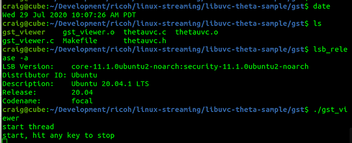
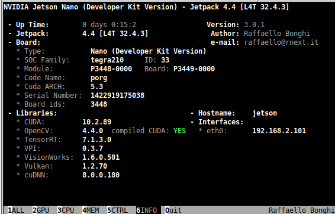
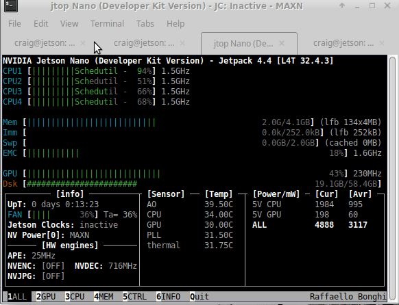

## Hardware Requirements for Linux and the RICOH THETA


### Jetson Nano - Reference Platform

Our reference platform is the NVIDIA Jetson Nano,
[ref](https://developer.nvidia.com/embedded/jetson-nano-developer-kit). 
We are using B01, but A02 should also work. 

running JetPack 4.4, which is Ubuntu 18.04.
The Nano is an ARM A57 with a 128-core Maxwell GPU,
4GB 64-bit LPDDR4.


The nano is powered by a 5V 4A barrel connector,
not the microUSB which is 5V 2A.  Our Nano has
an external fan on the PWM header and a 64GB
microSD card.

#### Parts

* [NVIDIA Jetson Nano Developer Kit B01](https://amzn.to/3396bbI)
* [SMAKIN DC 5V/4A power supply with barrel connector](https://amzn.to/3290mvu)
* [Waveshare 5V PWM fan - cheaper option](https://amzn.to/3h9A3cT) - we used this one as we are frugal.  It worked. 
* [Noctua 5V PWM fan - better option, around $15](https://amzn.to/3m1IDxT) - most people use this one.
* For Z1 streaming [10' USB-C live streaming cable](https://amzn.to/328P6za) - it works for me,
but it is over the recommended length.  I only have the long cable for convenience. You
should use as short a cable as possible. 

### x86 Linux

We've also tested the libuvc-theta (streaming) and
libuvc-theta-sample (streaming sample application)
on x86 64bit Linux using Ubuntu 20.04 LTS, Focal Fossa.

Watch this [build video walkthrough](https://www.youtube.com/watch?v=Ji4WDvPHzQk).




We've tested v4l2loopback with gst_loopback on a low-end Pentium
x86 computer.  It works fine.  Thanks to commuity member Yu You
for this fix to gst_view.c.  Note the addition of `qos=false` to
the pipeline.  This is currently on 
[line 190](https://github.com/ricohapi/libuvc-theta-sample/blob/f8c3caa32bf996b29c741827bd552be605e3e2e2/gst/gst_viewer.c#L190).

```c
if (strcmp(cmd_name, "gst_loopback") == 0)
    pipe_proc = "decodebin ! autovideoconvert ! "
        "video/x-raw,format=I420 ! identity drop-allocation=true !"
        "v4l2sink device=/dev/video0 qos=false sync=false";
```

Screenshot of loopback running on `/dev/video0`, tested with vlc.


#### Addtional x86 Information

If you're having problems after making the modification
described above, you can try to temporarily disable your
dedicated graphics card on x86. In our tests on Ubuntu 20, Focal Fossa, the gstreamer vaapi plugin can't use the hardware decoder on the NVIDIA GPU with the proprietary NVIDIA driver. The causes gstreamer to use a software decoder instead.

This will likely cause many frame drops on your system. You can verify this by setting the GST_DEBUG environment variable to 2 or 3 and then running gst_loopback. You will likely see many frame drop messages.

There are two possible workarounds:

1. Use the nvdec plugin Although the nvdec plugin is a part of the gstreamer-plugins-bad, it is not included in binary distribution due to license problem. Thus, you have to build the plugin by yourself. You also need to modify the pipeline of the gst_loopback accordingly.
2. Use hardware decoder on the iGPU You may need additional setup to run X server on the iGPU,


### Raspberry Pi

The Raspberry Pi will work great with the USB API.  However, you 
will not have a good experience streaming 4K, even with the 
Raspberry Pi 4.

The Raspberry Pi's H.264 hardware decoder does not support 4K resolution even on the Raspberry Pi4. In addition, older Pis' (Pi to Pi3) memory bandwidth(32bit DDR2) is too poor to handle even FHD stream from THETA V/Z1.

### NVIDIA Jetson Xavier

The Xavier is better for testing.  However, it is more expensive.  If your 
budget permits, it is better to get the Xavier.  You may have problems
with 4K AI processing with the Nano.

On Jetson Xavier, auto plugin selection of the gstreamer seems to be not working well, replacing "decodebin ! autovideosink sync=false" to "nvv4l2decoder ! nv3dsink sync=false" will solve the problem. Edit this 
[line](https://github.com/ricohapi/libuvc-theta-sample/blob/f8c3caa32bf996b29c741827bd552be605e3e2e2/gst/gst_viewer.c#L192) in the sample code and recompile.

### Heat and Cooling of Linux Computer

You need to cool the Nano.  Without a fan, you may get thermal 
throttling when live streaming
with AI processing. 


The fan is 5V pwm.  I've also used a 12V fan before I
ordered the 5V fan from Amazon.

## Hardware Acceleration

You will need to use hardware acceleration to get reasonable performance.

To verify that you are using GPU acceleration, you can use `tegrastats` on
Jetson and `nvidia-smi` on x86. 

### Jetson

You can either use tegrastats or jetson-stats to see information on your CPU and GPU to
identify performance bottlenecks.

#### tegrastats

On NVIDIA Jetson, `tegrastats` is useful for seeing information on the GPU.
In the example below, I've inserted line breaks to make the output easier to read.
The output is shown before streaming starts.

```
craig@jetson:~$ tegrastats 
RAM 1122/3964MB (lfb 28x4MB)
SWAP 211/1982MB (cached 20MB)
CPU [5%@102,9%@102,0%@102,0%@102]
EMC_FREQ 0% 
GR3D_FREQ 0% 
PLL@25.5C CPU@27C PMIC@100C 
GPU@27.5C AO@35C thermal@27.5C 
POM_5V_IN 1805/1805 
POM_5V_GPU 0/0 
POM_5V_CPU 123/123
```

Let's start the stream and review it again.

```
RAM 1288/3964MB (lfb 28x4MB) 
SWAP 210/1982MB (cached 20MB) 
CPU [100%@1479,89%@1479,85%@1479,86%@1479] 
EMC_FREQ 0% 
GR3D_FREQ 35% 
PLL@32C CPU@35C PMIC@100C 
GPU@30.5C AO@40.5C thermal@32.25C 
POM_5V_IN 5607/5561 
POM_5V_GPU 118/98 
POM_5V_CPU 2843/2791
```

The GR3D_FREQ and POM_5V_GPU provide information on the GPU.  GR3D is the
Jetson GPU engine.  More information on tegrastatus is 
[here](https://docs.nvidia.com/jetson/archives/l4t-archived/l4t-3231/index.html#page/Tegra%20Linux%20Driver%20Package%20Development%20Guide/AppendixTegraStats.html).

#### jetson-stats

Another nice package is [jetson-stats](https://github.com/rbonghi/jetson_stats).

You can verify if your base libraries such as OpenCV have features such as CUDA enabled.



Prior to streaming, your system should show very little load. 


Once streaming starts, the load on your GPU should increase.  The example below
shows OpenCV and a Python script for canny edge detection.


The example below is using OpenCV to convert the color space.




### x86

Prior to starting the stream.

```
$ nvidia-smi 
Mon Sep 14 06:14:55 2020       
+-----------------------------------------------------------------------------+
| NVIDIA-SMI 440.100      Driver Version: 440.100      CUDA Version: 10.2     |
|-------------------------------+----------------------+----------------------+
| GPU  Name        Persistence-M| Bus-Id        Disp.A | Volatile Uncorr. ECC |
| Fan  Temp  Perf  Pwr:Usage/Cap|         Memory-Usage | GPU-Util  Compute M. |
|===============================+======================+======================|
|   0  GeForce GTX 950     Off  | 00000000:02:00.0  On |                  N/A |
|  1%   52C    P5    14W /  99W |    355MiB /  1999MiB |      0%      Default |
+-------------------------------+----------------------+----------------------+
                                                                               
+-----------------------------------------------------------------------------+
| Processes:                                                       GPU Memory |
|  GPU       PID   Type   Process name                             Usage      |
|=============================================================================|
|    0      1051      G   /usr/lib/xorg/Xorg                            52MiB |
|    0      1619      G   /usr/lib/xorg/Xorg                           113MiB |
|    0      1820      G   /usr/bin/gnome-shell                         102MiB |
|    0      2822      G   ...AAAAAAAAAAAACAAAAAAAAAA= --shared-files    73MiB |
+-----------------------------------------------------------------------------+

```