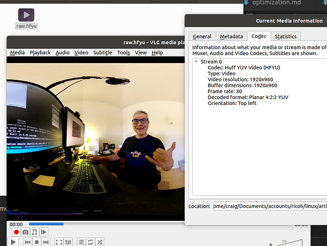

# Usage Examples

## stream to YouTube with ffmpeg

from [Paul Gullett](https://community.theta360.guide/u/Paul_Gullett).
[post](https://community.theta360.guide/t/live-streaming-over-usb-on-ubuntu-and-linux-nvidia-jetson/4359/117?u=craig)

```
ffmpeg -f lavfi -i anullsrc \
-f v4l2 -s 3480x1920 -r 10 -i /dev/video0 \
-vcodec libx264 -pix_fmt yuv420p -preset ultrafast \
-strict experimental -r 25 -g 20 -b:v 2500k \
-codec:a libmp3lame -ar 44100 -b:a 11025 -bufsize 512k \
-f flv rtmp://a.rtmp.youtube.com/live2/secret-key
```
As my knowledge of ffmpeg is weak, I simplified Paul's
video pipeline.

```
 ffmpeg -f lavfi -i anullsrc -f v4l2 -s 1920x960 -r 10 -i /dev/video2 \
-vcodec libx264 -pix_fmt yuv420p \
 -b:v 2500k \
-codec:a libmp3lame -ar 44100 -b:a 11025 -bufsize 512k \
-f flv rtmp://a.rtmp.youtube.com/live2/$SECRET_KEY
```


## stream to another computer with gstreamer

by [zdydek](https://community.theta360.guide/u/zdydek). 
[post](https://community.theta360.guide/t/live-streaming-over-usb-on-ubuntu-and-linux-nvidia-jetson/4359/78?u=craig)

in gst_viewer.c

```
pipe_proc = " rtph264pay name=pay0 pt=96 ! udpsink host=127.0.0.1 port=5000 sync=false ";
```

with gst-rtsp-server

```
./test-launch "( udpsrc port=5000 ! application/x-rtp, media=(string)video, clock-rate=(int)90000, encoding-name=(string)H264 ! rtph264depay ! h264parse ! rtph264pay name=pay0 pt=96 )"
```

Receive on ROS.

```
GSCAM_CONFIG="rtspsrc location=rtspt://10.0.16.1:8554/test latency=400 drop-on-latency=true ! application/x-rtp, encoding-name=H264 ! rtph264depay ! decodebin ! queue ! videoconvert"  roslaunch gscam_nodelet.launch
```

## Simplified computer to computer streaming with rtsp and gstreamer

This was tested going from an x86 machine to a Jetson Nano.
The THETA Z1 is connected to the x86 Linux machine.  It is not 
working with the Jetson as the sender.

On x86 computer sending THETA video.

Modify the pipeline in `gst_viewer.c`

This example has the IP address hardcoded in.  Switch to a variable in
your code.

```c
pipe_proc = " decodebin ! jpegenc ! rtpjpegpay ! udpsink host=192.168.2.100 port=5000 qos=false sync=false";
```


If you are looking for the IP address of the receiver, you can use arp-scan on 
the command line.

Example:

```
sudo arp-scan --interface=eth0 --localnet
```

On the receiving device, if the receiver is a NVIDIA Jetson Nano.

```bash
$ cat receive_udp.sh 
gst-launch-1.0 udpsrc port=5000 !  application/x-rtp,encoding-name=JPEG,payload=26 ! rtpjpegdepay ! jpegdec ! videoscale ! video/x-raw,width=640,height=320 ! nveglglessink
```
If you're on x86, change nveglglessink to autovideosink.  You may want to make
the width and height bigger as well. 


## Save to File

by [Les Wu aka snafu666](https://community.theta360.guide/u/snafu666). 
[post](https://community.theta360.guide/t/live-streaming-over-usb-on-ubuntu-and-linux-nvidia-jetson/4359/122?u=craig)

> Using the v4l2loopback capability and thetaV loopback example, here are 2 example gstreamer pipelines to grab the video:

As a lossless huffman encoded raw file:

```bash
gst-launch-1.0 v4l2src device=/dev/video99 ! video/x-raw,framerate=30/1 \
! videoconvert \
! videoscale \
! avenc_huffyuv \
! avimux \
! filesink location=raw.hfyu
```

And with default h.264 encoding on a Jetson:

```
gst-launch-1.0 v4l2src device=/dev/video99 ! video/x-raw,framerate=30/1 \
! nvvidconv \
! omxh264enc \
! h264parse ! matroskamux \
! filesink location=vid99.mkv
```

> Pro tip, when you install v4l2loopback, use the video_nr option to create the video device somewhere high so it does not get displaced by PnP of other cameras.

The Huffyuv format is a large file format.  [VLC can play it](https://wiki.videolan.org/Huffyuv/).

Here's a shot of me playing a file that I generated with Les's pipeline.



On x86, this is the pipeline I used to save to a H.264 file.

```
$ gst-launch-1.0 v4l2src device=/dev/video2 ! video/x-raw,framerate=30/1 ! autovideoconvert ! nvh264enc ! h264parse ! matroskamux ! filesink location=vid_test.mkv
```

Example of playing file with gst-launch.

```
gst-launch-1.0 playbin uri=file:///path-to-file/vid_test.mkv
```


## Stream From Raspberry Pi 4 to a Windows PC

Thanks to Shun Yamashita of [fulldepth](https://fulldepth.co.jp/) for this solution
to stream the Z1 video to a Raspberry Pi 4 with USB then restream it to a Windows PC.

This is the process:

* Use GStreamer to stream UDP(RTP) to the Windows PC
* Do not use H264 decoding on the Raspberry Pi as the Windows machine is handling it and it's likely
that the RPi4 can't use hardware decoding for 4K H.264.
* Tested with Raspberry Pi4 modelB with 4GB of RAM running Raspberry Pi OS

On the Raspberry Pi, the following was changed in the GStreamer pipeline in `gst/gst_viewer.c`.

```c
src.pipeline = gst_parse_launch(
        " appsrc name=ap ! queue ! h264parse ! queue"
        " ! rtph264pay ! udpsink host=192.168.0.15 port=9000",
        NULL);
```
