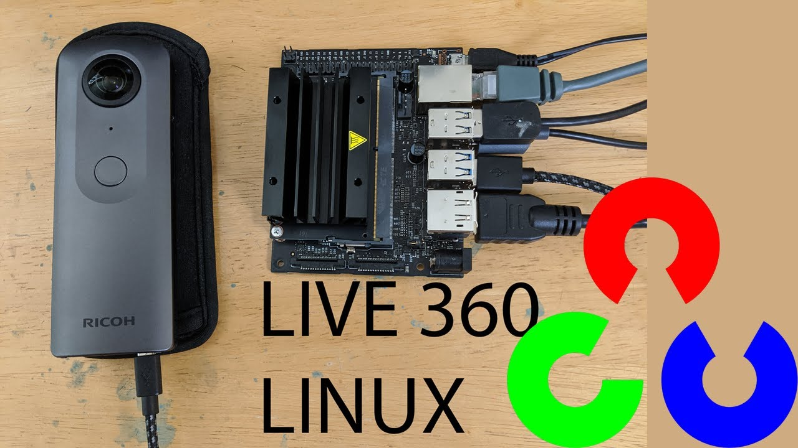

# RICOH THETA Development on Linux



## Overview

Stream 360 video, control the RICOH THETA API, and supply power to
the camera using the USB cable.  It's awesome!

Video to your Linux computer is 4K at 30fps with under 300ms latency. 
Works with the RICOH THETA V or RICOH THETA Z1.  It's perfect for
OpenCV object detection, autonomous drones, building analysis,
AI, and TensorFlow projects.

The camera can be powered from the USB cable and can switch
into live streaming mode, still image, video, or bracket shooting
using API commands. We explain the tools, the repos, and the 
API.

Up to date guides, events, and a general pile of great stuff is at the
[theta360.guide Linux Streaming Site](https://theta360.guide/special/linuxstreaming/).

 It's an exciting world.  Let's getting started.

 If you're eager and using Ubuntu 20.04 or 22.04

```bash
git clone https://github.com/ricohapi/libuvc-theta.git
sudo apt install libjpeg-dev
cd libuvc-theta
mkdir build
cd build
cmake ..
make
sudo make install
cd ../..
git clone https://github.com/ricohapi/libuvc-theta-sample.git
cd libuvc-theta-sample/gst
make

# THETA must be plugged into your computer and in 
# live streaming mode

$ ./gst_viewer
```
This assumes you have a non-THETA webcam on `/dev/video0` (your laptop or desktop cam).  
You may need to edit the source if your THETA is the only camera on your computer.

If the build fails, you may need a few gstreamer packages.
The command below installs everything.  You do not need everything

```bash
sudo apt-get install libgstreamer1.0-0 gstreamer1.0-plugins-base gstreamer1.0-plugins-good gstreamer1.0-plugins-bad gstreamer1.0-plugins-ugly gstreamer1.0-libav gstreamer1.0-doc gstreamer1.0-tools gstreamer1.0-x gstreamer1.0-alsa gstreamer1.0-gl gstreamer1.0-gtk3 gstreamer1.0-qt5 gstreamer1.0-pulseaudio libgstreamer-plugins-base1.0-dev
```


