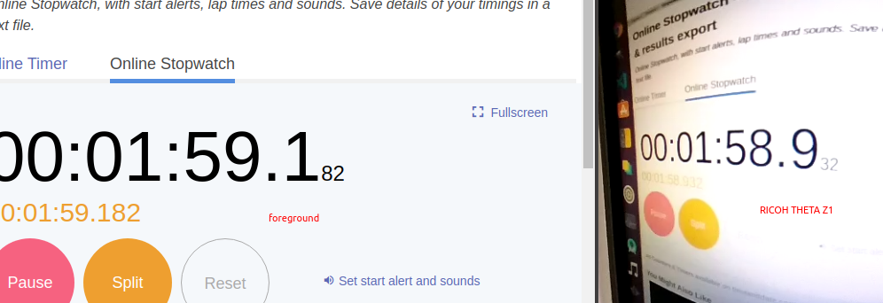
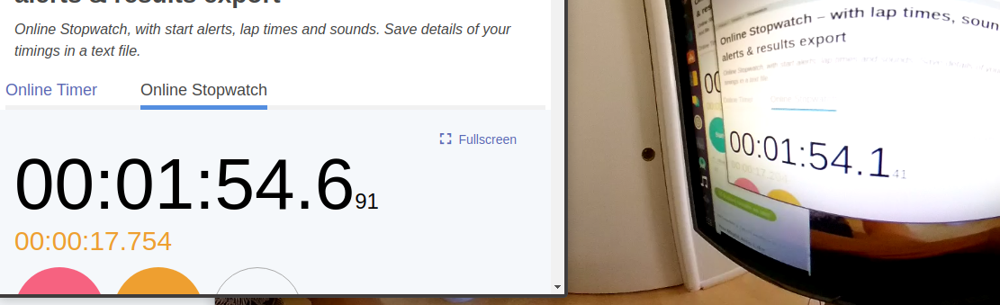

# gstreamer optimization on x86

We reduced latency from the default 550ms to 220ms. The latency is measured from the camera to the screen and may not be as relevant
to machine vision.  We achieved this improvement
by using two gstreamer plug-ins:

* nvdec hardware decoding plug-in for NVIDIA GPUs
* glimagesink OpenGL plug-in

## Overview

nvdec applies hardware decoding to the THETA H.264 stream and
outputs buffers in raw format on the GPU.

## Tests

### nvdec and glimagesink

```
pipe_proc = "nvdec ! glimagesink qos=false sync=false";
```



foreground: 59.182

THETA video: 58.932

Latency: 250ms

### Default decodebin and autovideosink

```
pipe_proc = " decodebin ! autovideosink sync=false";
```




foreground: 691

THETA video: 141

Latency: 550ms

## Reduce Latency by 50%