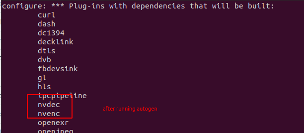
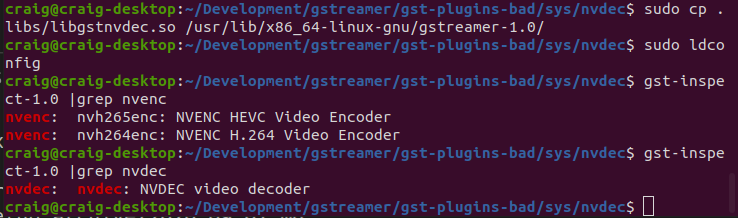

# gstreamer optimization on x86

We reduced latency from the default 550ms to 220ms. The latency is measured from the camera to the screen and may not be as relevant
to machine vision.  We achieved this improvement
by using two gstreamer plug-ins:

* nvdec hardware decoding plug-in for NVIDIA GPUs
* glimagesink OpenGL plug-in

## Overview

nvdec applies hardware decoding to the THETA H.264 stream and
outputs buffers in raw format on the GPU.

## Tests

### nvdec and glimagesink

```
pipe_proc = "nvdec ! glimagesink qos=false sync=false";
```


foreground: 59.182

THETA video: 58.932

Latency: 250ms

### Default decodebin and autovideosink

```
pipe_proc = " decodebin ! autovideosink sync=false";
```


foreground: 691

THETA video: 141

Latency: 550ms

## Result: Latency Reduced by 50%

## Equipment

* Intel i7-6800K
* NVIDIA GTX 950 GPU
* RICOH THETA Z1 with firmware 1.60.1

## Software
* Ubuntu 20.04
* NVIDIA Linux graphics driver 455.23
* CUDA Version: 11.1
* gstreamer 1.16.2
* NVIDIA Video Codec 11.0.10

## Overview of Steps

1. verify that you don't have nvdec installed.  If you have it installed, you can skip most of this document and go to the section on the gstreamer pipline configuration of gst_viewer.c
2. Download and install [gst-plugins-bad](https://github.com/GStreamer/gst-plugins-bad)
3. Install [NVIDIA CODEC SDK](https://developer.nvidia.com/nvidia-video-codec-sdk/download)

4. Modify gst_viewer pipeline to use the nvdec plug-in for hardware decoding and glimagesink for display to the screen

## Tips

### Verify if you have nvdec installed.

```
$ gst-inspect-1.0 nvdec
No such element or plugin 'nvdec'
```

If nvdec is installed, you will see this:

```
$ gst-inspect-1.0 | grep nvdec
nvdec:  nvdec: NVDEC video decoder
```

### Download the gst-plugins-bad

After you clone the repo, you need
to checkout the branch that is the same
as the version of gstreamer you have
installed.


Clone repo.

```
git clone git://anongit.freedesktop.org/gstreamer/gst-plugins-bad
cd gst-plugins-bad/

# verify gstreamer version
$ gst-inspect-1.0 --version
gst-inspect-1.0 version 1.16.2
GStreamer 1.16.2

$ git checkout 1.16.2
HEAD is now at a6f26408f Release 1.16.2

# verify that you're on the correct branch
$ git branch
* (HEAD detached at 1.16.2)
  master
```


### Install NVIDIA CODEC SDK

1. Download [NVIDIA CODEC SDK](https://developer.nvidia.com/nvidia-video-codec-sdk/download).
2. Unzip to `/path/to/video/codec/sdk`


```
cd /path/to/video/codec/sdk
cp /usr/local/cuda/include/cuda.h /path/to/gst-plugins-bad/sys/nvenc
cp Interface/nvEncodeAPI.h /path/to/gst-plugins-bad/sys/nvenc
cp Interface/cuviddec.h /path/to/gst-plugins-bad/sys/nvdec
cp Interface/nvcuvid.h /path/to/gst-plugins-bad/sys/nvdec
```

### Build and Install Plug-in


Configure and build.

```
$ NVENCODE_CFLAGS="-I/home/craig/Development/gstreamer/gst-plugins-bad/sys/nvenc" ./autogen.sh --disable-gtk-doc --with-cuda-prefix="/usr/local/cuda"

cd sys/nvenc
make
sudo cp .libs/libgstnvenc.so /usr/lib/x86_64-linux-gnu/gstreamer-1.0/
cd ../nvdec
make
sudo cp .libs/libgstnvdec.so /usr/lib/x86_64-linux-gnu/gstreamer-1.0/
```

Confirm that autogen configured project to
build nvdec.



### Verify Install



### Configure gst_viewer.c

Pipeline is roughly around line
192.  GitHub permalink is [here](https://github.com/ricohapi/libuvc-theta-sample/blob/f8c3caa32bf996b29c741827bd552be605e3e2e2/gst/gst_viewer.c#L192).

```
	else
		// original pipeline
        // pipe_proc = " decodebin ! autovideosink sync=false";
		// use gstreamer plug-in for hardware acceleration
		pipe_proc = "nvdec ! glimagesink qos=false sync=false";
```

## Results

### Original Pipeline

The left video is a Logitech C920 USB webcam. The right video is the THETA. 

Original pipeline.  There is a lag on the THETA video when I move my hand.   


### nvdec pipeline

The THETA video stream is now much closer to the latency of the NVIDIA C920. 


## Configuration with v4l2loopack on /dev/video*

To use nvdec with v4l2loopback, I needed to download the OpenGL textures from the GPU to video frames.  This introduced some latency.
However, testing with vlc still showed 
improvement over the standard pipeline.

```
	if (strcmp(cmd_name, "gst_loopback") == 0)
	// original pipeline
		// pipe_proc = "decodebin ! autovideoconvert ! "
		// 	"video/x-raw,format=I420 ! identity drop-allocation=true !"
		// 	"v4l2sink device=/dev/video2 qos=false sync=false";
		//
		//modified pipeline below
		pipe_proc = "nvdec ! gldownload ! videoconvert n-thread=0 ! "
			"video/x-raw,format=I420 ! identity drop-allocation=true !"
			"v4l2sink device=/dev/video2 qos=false sync=false";		
```

More information on using gldownload is available [here](https://gstreamer.freedesktop.org/data/doc/gstreamer/head/gst-plugins-gl-plugins/html/gst-plugins-gl-plugins-gldownload.html).

### v4l2loopback and vlc example

vlc is accessing the camera on `/dev/video2`.  I'm doing the test at night in a darkened room.

