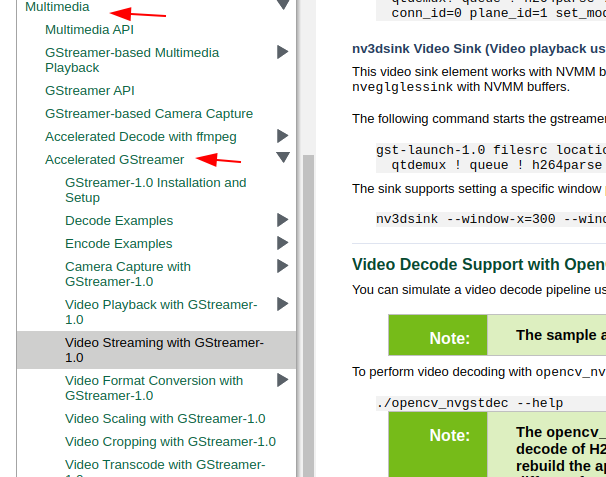

# gstreamer optimization on x86

We reduced latency from the default 550ms to 220ms. The latency is measured from the camera to the screen and may be higher with
machine vision that may need to move the frame from
the GPU to system memory.  We achieved this improvement
by using two gstreamer plug-ins:

* nvdec hardware decoding plug-in for NVIDIA GPUs
* glimagesink OpenGL plug-in

## Overview

nvdec uses dedicated NVIDIA GPU hardware decoding
features and fast copy to move frames between system and GPU memory.  
The THETA H.264 stream is decoded on the GPU and
outputs buffers in raw format on the GPU.  

Instead of downloading the frame from the GPU to system
memory, we use glimagesink to display the OpenGL textures 
to the computer monitor without having to transfer the frame to
system memory.

To use v4l2loopback, we show how to use gldownload to
transfer the frame into system memory. Although this technique
increases latency, it appears to be faster than streaming without
hardware decoding on our test system.

## Audience

If you already have streaming working with the THETA
on your x86 Linux machine 
and want to experiment with reducing latency, this article
will guide you through installing and configuring
hardware decoding on the GPU.

If you are using NVIDIA Jetson boards, you do
not need this article. On Nano hardware, you are likely
already using hardware acceleration.
If you are using NVIDIA Jetson Xavier hardware, 
the hardware decoder is nvv4l2decoder and is included
in JetPack, the Jetson OS you download from NVIDIA.
On Jetson, the sink is nv3dsink.

If you are using x86 and do not have streaming working
at all, you should first try this pipeline.

```
pipe_proc = " decodebin ! autovideosink sync=false qos=false";
```

Note that both sync and qos are false.

If you have enabled the pipeline above and your framerate is
still extremely slow, you can try installing all the gstreamer
plug-ins using apt from binaries.  

If you're still stuck with unusable framerates, this article on
using the dedicated video decoder on the GPU may help.  However,
due to the number of steps involved in installing the gstreamer plug-in,
the primary target audience is someone that already has 
live streaming working and is interested in trying to reduce
latency.

## Tests

### nvdec and glimagesink

```
pipe_proc = "nvdec ! glimagesink qos=false sync=false";
```


foreground: 59.182

THETA video: 58.932

Latency: 250ms

### Default decodebin and autovideosink

```
pipe_proc = " decodebin ! autovideosink sync=false";
```


foreground: 691

THETA video: 141

Latency: 550ms

## Result: Latency Reduced by 50%

## Equipment

* Intel i7-6800K
* NVIDIA GTX 950 GPU
* RICOH THETA Z1 with firmware 1.60.1

## Software
* Ubuntu 20.04
* NVIDIA Linux graphics driver 455.23
* CUDA Version: 11.1
* gstreamer 1.16.2
* NVIDIA Video Codec 11.0.10

## Overview of Steps

1. verify that you don't have nvdec installed.  If you have it installed, you can skip most of this document and go to the section on the gstreamer pipline configuration of gst_viewer.c
2. Download and install [gst-plugins-bad](https://github.com/GStreamer/gst-plugins-bad)
3. Install [NVIDIA CODEC SDK](https://developer.nvidia.com/nvidia-video-codec-sdk/download)

4. Modify gst_viewer pipeline to use the nvdec plug-in for hardware decoding and glimagesink for display to the screen

## Tips

### Verify if you have nvdec installed.

```
$ gst-inspect-1.0 nvdec
No such element or plugin 'nvdec'
```

If nvdec is installed, you will see this:

```
$ gst-inspect-1.0 | grep nvdec
nvdec:  nvdec: NVDEC video decoder
```

### Download the gst-plugins-bad

After you clone the repo, you need
to checkout the branch that is the same
as the version of gstreamer you have
installed.


Clone repo.

```
git clone git://anongit.freedesktop.org/gstreamer/gst-plugins-bad
cd gst-plugins-bad/

# verify gstreamer version
$ gst-inspect-1.0 --version
gst-inspect-1.0 version 1.16.2
GStreamer 1.16.2

$ git checkout 1.16.2
HEAD is now at a6f26408f Release 1.16.2

# verify that you're on the correct branch
$ git branch
* (HEAD detached at 1.16.2)
  master
```


### Install NVIDIA CODEC SDK

1. Download [NVIDIA CODEC SDK](https://developer.nvidia.com/nvidia-video-codec-sdk/download).
2. Unzip to `/path/to/video/codec/sdk`


```
cd /path/to/video/codec/sdk
cp /usr/local/cuda/include/cuda.h /path/to/gst-plugins-bad/sys/nvenc
cp Interface/nvEncodeAPI.h /path/to/gst-plugins-bad/sys/nvenc
cp Interface/cuviddec.h /path/to/gst-plugins-bad/sys/nvdec
cp Interface/nvcuvid.h /path/to/gst-plugins-bad/sys/nvdec
```

### Build and Install Plug-in


Configure and build.

```
$ NVENCODE_CFLAGS="-I/home/craig/Development/gstreamer/gst-plugins-bad/sys/nvenc" ./autogen.sh --disable-gtk-doc --with-cuda-prefix="/usr/local/cuda"

cd sys/nvenc
make
sudo cp .libs/libgstnvenc.so /usr/lib/x86_64-linux-gnu/gstreamer-1.0/
cd ../nvdec
make
sudo cp .libs/libgstnvdec.so /usr/lib/x86_64-linux-gnu/gstreamer-1.0/
```

Confirm that autogen configured project to
build nvdec.


### Verify Install


### Configure gst_viewer.c

Pipeline is roughly around line
192.  GitHub permalink is [here](https://github.com/ricohapi/libuvc-theta-sample/blob/f8c3caa32bf996b29c741827bd552be605e3e2e2/gst/gst_viewer.c#L192).

```
	else
		// original pipeline
        // pipe_proc = " decodebin ! autovideosink sync=false";
		// use gstreamer plug-in for hardware acceleration
		pipe_proc = "nvdec ! glimagesink qos=false sync=false";
```

## Results

### Original Pipeline

The left video is a Logitech C920 USB webcam. The right video is the THETA. 

Original pipeline.  There is a lag on the THETA video when I move my hand.   


### nvdec pipeline

The THETA video stream is now much closer to the latency of the NVIDIA C920. 


## Configuration with v4l2loopack on /dev/video*

To use nvdec with v4l2loopback, I needed to download the OpenGL textures from the GPU to video frames.  This introduced some latency.
However, testing with vlc still showed 
improvement over the standard pipeline.

```
	if (strcmp(cmd_name, "gst_loopback") == 0)
	// original pipeline
		// pipe_proc = "decodebin ! autovideoconvert ! "
		// 	"video/x-raw,format=I420 ! identity drop-allocation=true !"
		// 	"v4l2sink device=/dev/video2 qos=false sync=false";
		//
		//modified pipeline below
		pipe_proc = "nvdec ! gldownload ! videoconvert n-thread=0 ! "
			"video/x-raw,format=I420 ! identity drop-allocation=true !"
			"v4l2sink device=/dev/video2 qos=false sync=false";		
```

More information on using gldownload is available [here](https://gstreamer.freedesktop.org/data/doc/gstreamer/head/gst-plugins-gl-plugins/html/gst-plugins-gl-plugins-gldownload.html).


### v4l2loopback and vlc example

vlc is accessing the camera on `/dev/video2`.  I'm doing the test at night in a darkened room.


## NVIDIA Jetson

The Jetson is likely already using hardware accleration.
You can get more examples on using gstreamer with `nvv4l2decoder`,
`nvvidconv`, and `nv3dsink` in the NVIDIA Accelerated GStreamer
guide.  Hopefuly, [this link works](https://docs.nvidia.com/jetson/l4t/index.html#page/Tegra%2520Linux%2520Driver%2520Package%2520Development%2520Guide%2Faccelerated_gstreamer.html%23wwpID0E0HN0HA). 

If the link is broken, use Google search or go to the [NVIDIA Jetson
Linux Developer Guide](https://docs.nvidia.com/jetson/l4t/) and 
go to the Multimedia section.



## References
* [README for gst-plugins-bad nvenc](https://github.com/GStreamer/gst-plugins-bad/blob/1.14.5/sys/nvenc/README)
* [How to install NVIDIA Gstreamer plugins (nvenc, nvdec) on Ubuntu](http://lifestyletransfer.com/how-to-install-nvidia-gstreamer-plugins-nvenc-nvdec-on-ubuntu/) by Taras Lishchenko on LifeStyleTransfer
* [Install NVDEC and NVENC on Gstreamer plugins](https://gist.github.com/corenel/a615b6f7eb5b5425aa49343a7b409200) by Corenel on Gist
* [NVIDIA Hardware accelerated video Encoding/Decoding (nvcodec) - Gstreamer](https://medium.com/@nareshkumarganesan/nvidia-hardware-accelerated-video-encoding-decoding-nvcodec-gstreamer-4b8eab662bf1) by Naresh Ganesan on Medium