This document covers two different strategies:

1. libptp - either as library or with command line ptpcam
2. gphoto2 - command line and Python bindings to library

## Setup libptp


### Download libptp source

[libptp - Picture Transfer Protocol lib](https://sourceforge.net/projects/libptp/)

Get the newest version, which is 2-1.2 right now.

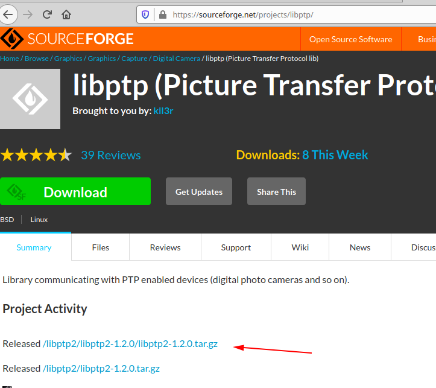

### build libptp

```bash
$ ./configure
$ make
```

If you have a build error when compiling libusb, you may need to install the 
development libraries for libusb.

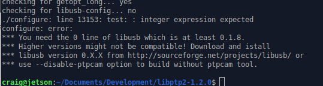

### install libusb-dev

```bash
$ sudo apt install libusb-dev
```

You may not need this step if you already have the libusb development
libraries installed.

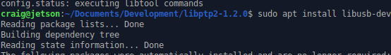

Example on x86 Ubuntu 20.04. 

```
$ sudo apt-get install libusb-dev
```


### install libptp

```bash
$ sudo make install
```

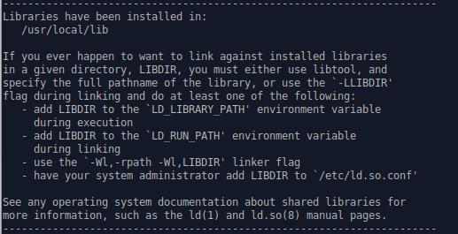

On x86 Ubuntu 20.04.

```
$ tar zxvf libptp2-1.2.0.tar.gz 
libptp2-1.2.0/
```

`./configure` ran with no problems  
`make` ran with no problems  
`sudo make install` ran with no problems  

```
$ pwd
/usr/local/lib
$ ls -l libptp2.*
-rw-r--r-- 1 root root 352640 Aug 31 11:54 libptp2.a
-rwxr-xr-x 1 root root    941 Aug 31 11:54 libptp2.la
lrwxrwxrwx 1 root root     16 Aug 31 11:54 libptp2.so -> libptp2.so.1.1.5
lrwxrwxrwx 1 root root     16 Aug 31 11:54 libptp2.so.1 -> libptp2.so.1.1.5
-rwxr-xr-x 1 root root 249352 Aug 31 11:54 libptp2.so.1.1.5
```


### set /usr/local/lib in library path

The default location of the libptp install is `/usr/local/lib`.  
Make sure that this is in your library path.  If it isn't,
add it to a file such as `libc.conf` in `/etc/ld.so.conf/`.

```
$ cd /etc/ld.so.conf.d/
$ ls
$ cat libc.conf
```

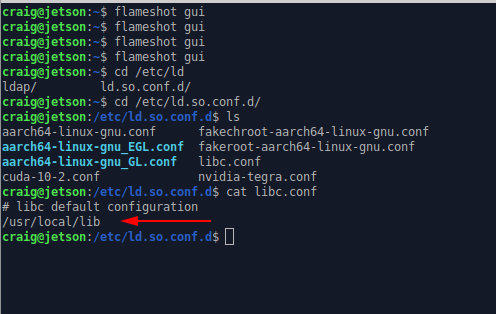

### run ldconfig

Load the library configuration.

```
$ sudo /sbin/ldconfig -v
```

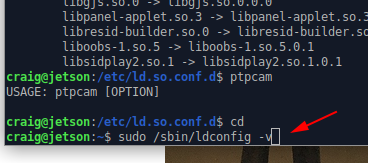

On x86 Ubuntu 20.04.

```
$ cd /etc/ld.so.conf.d/
$ l
fakeroot-x86_64-linux-gnu.conf  x86_64-linux-gnu.conf
i386-linux-gnu.conf             zz_i386-biarch-compat.conf
libc.conf
$ cat libc.conf 
# libc default configuration
/usr/local/lib
$ sudo ldconfig
$ 
```

### Test ptpcam

Connect RICOH THETA to Jetson with a USB cable.

Version of 2-1.2 of libptp has a bug in it.  Although
ptpcam does take pictures and function normally,
you will
see an error about capture status.

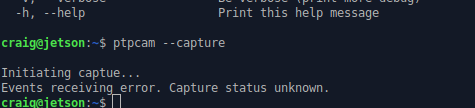

On x86 Ubuntu.

```
$ ptpcam --info

Camera information
==================
Model: RICOH THETA Z1
  manufacturer: Ricoh Company, Ltd.
  serial number: '10010104'
  device version: 1.50.1
  extension ID: 0x00000006
  extension description: (null)
  extension version: 0x006e

$ cat /proc/cpuinfo 
processor	: 0
vendor_id	: GenuineIntel
cpu family	: 6
model		: 60
model name	: Intel(R) Pentium(R) CPU G3258 @ 3.20GHz
```

### Fix problem with libptp response

Go to line 77 of `ptp.h` and change `PTP_USB_INT_PACKET_LEN` 
to `28`.

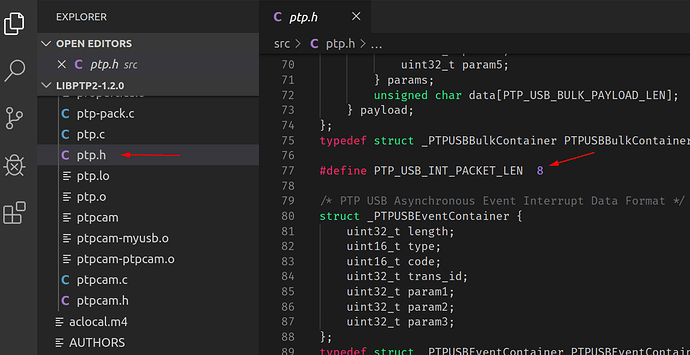

After modification, the code will look like this.

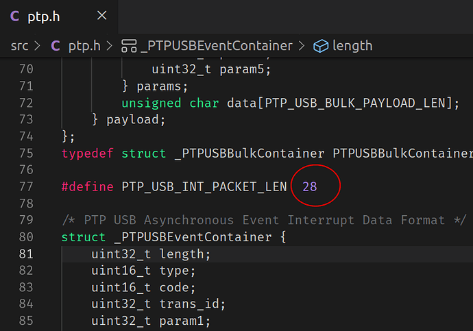

## Using USB API with ptpcam (libptp)

### test ptpcam response again

Take a still image picture with `ptpcam --capture`.

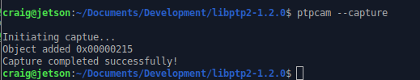

### Set camera to live streaming mode

Check on camera mode.

```
$ ptpcam --show-property=0x5013
```

Set to live streaming mode.

```
$ ptpcam --set-property=0x5013 --val=0x8005
```


Using the official 
[RICOH USB API documentation](https://api.ricoh/docs/theta-usb-api/property/still_capture_mode/), you can verify that
`0x8005` is live streaming mode.  The camera LED should show that
the THETA is in LIVE mode.


In our tests, the RICOH THETA Z1 could charge while streaming
over a USB 3.0 port (blue insert).  

After hours of streaming, the Z1 LED looks like this.

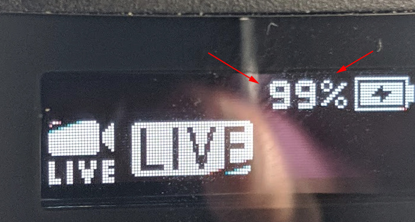

The response codes are shown below.

```
    0x0001 = single-shot shooting
    0x0003 = Interval shooting
    0x8002 = Movie shooting
    0x8003 = Interval composite shooting
    0x8004 = Multi bracket shooting
    0x8005 = Live streaming
    0x8006 = Interval shooting - tripod stabilizatio is off 
             (top/bottom correction and stitching optimized)
    0x8007 = Interval shooting - tripod stabilization is on
```

If you set the camera back to still image, single shot mode,
you will see this response.

```bash
$ ptpcam --set-property=0x5013 --val=0x0001

Camera: RICOH THETA V
'Still Capture Mode' is set to: 0x8005 (-32763)
Changing property value to 0x0001 [(null)] succeeded.
```

### Wake Camera From Sleep

In this test, I have the Z1 power off disabled.  I left the camera
in sleep mode overnight.  When I woke up in the morning,
I woke the Z1 up using an ssh session into the Jetson Nano and 
running this command.

```bash
$ ptpcam --set-property=0xD80E --val=0x00

Camera: RICOH THETA Z1
'UNKNOWN' is set to: 1
Changing property value to 0x00 [(null)] succeeded.
```

I tested the camera with the info command.

```bash
$ ptpcam --info

Camera information
==================
Model: RICOH THETA Z1
  manufacturer: Ricoh Company, Ltd.
  serial number: '10010104'
  device version: 1.50.1
  extension ID: 0x00000006
  extension description: (null)
  extension version: 0x006e
```

In my initial tests, I had to run the `info` command twice after
I woke the camera up from sleep. The first time, I could not
open the session.

I got this error.

```bash
$ ptpcam --info
ERROR: Could not open session!
```

In the future, I'll run more tests using the
camera [FunctionalMode](https://api.ricoh/docs/theta-usb-api/property/functional_mode/)
to check status.

This is another example with x86.  Initially, the camera is asleep.

```
craig@cube:~$ ptpcam --info

Camera information
==================
ERROR: Could not open session!
craig@cube:~$ ptpcam --info

Camera information
==================
Model: RICOH THETA Z1
  manufacturer: Ricoh Company, Ltd.
  serial number: '10010104'
  device version: 1.50.1
  extension ID: 0x00000006
  extension description: (null)
  extension version: 0x006e

craig@cube:~$ ptpcam --set-property=0xd80e --val=0

Camera: RICOH THETA Z1
'UNKNOWN' is set to: 1
Changing property value to 0 [(null)] succeeded.
```

At this point, the camera is awake.

### Put camera to sleep

```
$ ptpcam --set-property=0xd80e --val=0x01

Camera: RICOH THETA Z1
'UNKNOWN' is set to: 0
Changing property value to 0x01 [(null)] succeeded.
```

The camera is asleep.


### Put Camera in Still Image Mode

You may want to take a detailed picture of the scene based on triggers
from the live stream.

To do this, you need to take the camera out of live streaming mode
and put it into still image mode.  In the example below, I
wrapped ptpcam in a script that explains the hexcode properties
of the mode settings.  This helps me with testing.

```
$ ptpcam --set-property=0x5013 --val=0x0001

Camera: RICOH THETA Z1
'Still Capture Mode' is set to: [Normal]
Changing property value to 0x0001 [(null)] succeeded.

    0x0001 = single-shot shooting
    0x0003 = Interval shooting
    0x8002 = Movie shooting
    0x8003 = Interval composite shooting
    0x8004 = Multi bracket shooting
    0x8005 = Live streaming
    0x8006 = Interval shooting - tripod stabilizatio is off 
             (top/bottom correction and stitching optimized)
    0x8007 = Interval shooting - tripod stabilization is on
```

You can verify the mode of with 0x5013.

```
$ ptpcam --show-property=0x5013

Camera: RICOH THETA Z1
'Still Capture Mode' is set to: [Normal]
```

Compare this with the result when the camera is in live streaming
mode.

```
$ ptpcam --show-property=0x5013

Camera: RICOH THETA Z1
'Still Capture Mode' is set to: 0x8005 (-32763)

    0x0001 = single-shot shooting
    0x0003 = Interval shooting
    0x8002 = Movie shooting
    0x8003 = Interval composite shooting
    0x8004 = Multi bracket shooting
    0x8005 = Live streaming
    0x8006 = Interval shooting - tripod stabilizatio is off 
             (top/bottom correction and stitching optimized)
    0x8007 = Interval shooting - tripod stabilization is on
```

### Start Video Capture

This records video to file. 

```
ptpcam -R 0x101c,0,0,1
```

## gphoto2

### Command Line

#### Fixing Command Line Error - Could not claim the USB device

You may get this error.


```bash
$ gphoto2 --capture-image
                                                                               
*** Error ***              
An error occurred in the io-library ('Could not claim the USB device'): Could not claim interface 0 (Device or resource busy). Make sure no other program (gvfs-gphoto2-volume-monitor) or kernel module (such as sdc2xx, stv680, spca50x) is using the device and you have read/write access to the device.
ERROR: Could not capture image.
ERROR: Could not capture.
*** Error (-53: 'Could not claim the USB device') ***       
```

Fix for current session is to kill gvfs-gphoto2-volume-monitor and gvfsd-gphoto2 spawner.


```bash

$ ps aux |grep gvfs
...
craig       2422  0.0  0.0 442504 13528 ?        Sl   08:19   0:00 /usr/libexec/gvfsd-gphoto2 --spawner :1.3 /org/gtk/gvfs/exec_spaw/1
...
craig       1969  0.0  0.0 249860 10032 ?        Ssl  08:19   0:00 /usr/libexec/gvfs-gphoto2-volume-monitor
...

$ kill 2422
$ kill 1969
$ gphoto2 --capture-image
New file is in location /store_00020001/DCIM/100RICOH/R0010376.JPG on the camera
$ 
```

#### Removing gvfs-backend permanently

If you don't mount the THETA as a storage device with gphoto, you can remove gvfs-backend.  This is a workaround for the 
conflict when you use gphoto2 from the command line to talk to the THETA.


```
$ sudo apt remove gvfs-backends
[sudo] password for craig: 
Reading package lists... Done
Building dependency tree       
```

Reboot to test. 

After reboot. 

```
$ gphoto2 -l
There is 1 folder in folder '/'.                                               
 - store_00020001
There is 1 folder in folder '/store_00020001'.
 - DCIM
There are 2 folders in folder '/store_00020001/DCIM'.
 - 100RICOH
 - SingleLensShooting
There is 1 folder in folder '/store_00020001/DCIM/100RICOH'.
 - HDR07-22_18-13
There are 0 folders in folder '/store_00020001/DCIM/100RICOH/HDR07-22_18-13'.
There are 0 folders in folder '/store_00020001/DCIM/SingleLensShooting'.
```

It works!

#### Check Camera Mode (still image, video, streaming)

[StillCaptureMode API reference](https://api.ricoh/docs/theta-usb-api/property/still_capture_mode/)

```
$ gphoto2 --get-config=5013
Label: Still Capture Mode                                                      
Readonly: 0
Type: MENU
Current: 1
Choice: 0 1
Choice: 1 3
Choice: 2 32770
Choice: 3 32771
Choice: 4 32772
Choice: 5 32773
Choice: 6 32774
Choice: 7 32775
END
craig@craig-desktop:~$ 
```

#### set to video mode

Using the [API reference](https://api.ricoh/docs/theta-usb-api/property/still_capture_mode/), we can see that video mode is hex `0x8002` or 32770 in base 10.

```
$ gphoto2 --set-config=5013=32770
```


### Python bindings

From community member [mhenrie](https://community.theta360.guide/u/mhenrie)

[original post](https://community.theta360.guide/t/using-usb-api-mtp-on-macos/4521/9)

```python
"""
USB api for added performance over http

Theta api reference:
https://developers.theta360.com/en/docs/v2/usb_reference/

Unable to get mtp or ptp to connect to the camera; After some pain was able to get gphoto2 working
"""

import os
import time

import gphoto2 as gp

# Properties
SHUTTER_SPEED = 'd00f'
EXPOSURE_INDEX = '500f'
F_NUMBER = '5007'
AUDIO_VOLUME = '502c'
COLOR_TEMPERATURE = 'd813'
EXPOSURE_PROGRAM_MODE = '500e'

# milliseconds
TIMEOUT = 10
TIMEOUT_CAPTURE_DNG = 10000


def wait_for_event(camera, timeout=TIMEOUT, event_type=gp.GP_EVENT_TIMEOUT):
    """
    Wait for event_type to to be triggered.
    :param camera:
    :param timeout:
    :param event_type:
    :return: event_data
    """
    while True:
        _event_type, event_data = camera.wait_for_event(timeout)
        if _event_type == gp.GP_EVENT_TIMEOUT:
            return
        if _event_type == event_type:
            return event_data


def set_config_by_index(config, index):
    """Set config using choice index"""
    value = config.get_choice(index)
    config.set_value(value)

    return config


# def list_files(camera, path='/'):
#     result = []
#     # get files
#     for name, value in camera.folder_list_files(path):
#         result.append(os.path.join(path, name))
#     # read folders
#     folders = []
#     for name, value in camera.folder_list_folders(path):
#         folders.append(name)
#     # recurse over subfolders
#     for name in folders:
#         result.extend(list_files(camera, os.path.join(path, name)))
#     return result
#
#
# def get_file_info(camera, path):
#     folder, name = os.path.split(path)
#     return camera.file_get_info(folder, name)


class CameraUsb(object):
    """
    Define API for multiple exposure
    """
    def __init__(self, verbose=False):
        self.verbose = verbose

        self.camera = gp.Camera()

        self.camera_config = None
        self.status_config = None
        self.other_config = None
        self.shutter_speed_config = None
        self.shutter_speed_options = []

    def init(self):
        """
        Set manual exposure and other defaults
        :return: config
        """
        try:
            self.camera_config = self.camera.get_config()
        except gp.GPhoto2Error:
            raise RuntimeError("Unable to connect to Camera")

        self.other_config = self.camera_config.get_child_by_name('other')

        # Manual/f-stop/iso
        exposure_program_mode = self.other_config.get_child_by_name(EXPOSURE_PROGRAM_MODE)
        if not exposure_program_mode.get_value() == '1':
            print('Setting camera to Manual exposure program')
            exposure_program_mode.set_value('1')
            self.camera.set_config(self.camera_config)
            wait_for_event(self.camera)

            # When switching exposure program, we need to refresh the configs
            self.camera_config = self.camera.get_config()
            self.other_config = self.camera_config.get_child_by_name('other')

        self.status_config = self.camera_config.get_child_by_name('status')

        self.shutter_speed_config = self.other_config.get_child_by_name(SHUTTER_SPEED)
        self.shutter_speed_options = [str(x) for x in self.shutter_speed_config.get_choices()]
        if len(self.shutter_speed_options) != 61:
            raise RuntimeError('Unble to determine shutter speed options; restart app')

        fstop = self.other_config.get_child_by_name(F_NUMBER)
        fstop.set_value('560')

        iso = self.other_config.get_child_by_name(EXPOSURE_INDEX)
        iso.set_value('80')

        self.camera.set_config(self.camera_config)
        wait_for_event(self.camera)

    def get_info(self):
        """
        :return: Dict containing serialnumber, batterylevel, remainingpictures, etc
        """
        if not self.camera_config:
            self.init()

        battery_level = self.status_config.get_child_by_name('batterylevel').get_value()
        # Convert '67%' to int
        battery_level = int(''.join([x for x in battery_level if x.isdigit()]))

        info = {'serialnumber': self.status_config.get_child_by_name('serialnumber').get_value(),
                'cameramodel': self.status_config.get_child_by_name('cameramodel').get_value(),
                'deviceversion': self.status_config.get_child_by_name('deviceversion').get_value(),
                'batterylevel': battery_level,
                'remainingpictures': int(self.camera.get_storageinfo()[0].freeimages)}
        return info

    def take_picture(self, shutter_speed_index=None, color_temperature=None, volume=None):
        """
        Set camera options and take picture
        Blocking
        :param shutter_speed_index: int in range 0-60 (0 fastest shutter)
        :param color_temperature: in in range 2500-10000 by 100 increment
        :param volume: int in range 0-100
        :return: (jpg_path, dng_path)
        """
        t1 = time.time()
        if not self.camera_config:
            self.init()

        if shutter_speed_index is not None:
            self.shutter_speed_config.set_value(self.shutter_speed_options[shutter_speed_index])

        if color_temperature is not None:
            self.other_config.get_child_by_name(COLOR_TEMPERATURE).set_value(color_temperature)

        if volume is not None:
            self.other_config.get_child_by_name(AUDIO_VOLUME).set_value(str(volume))

        self.camera.set_config(self.camera_config)
        # We need this even though no event is triggered
        wait_for_event(self.camera)

        gp_jpg_path = self.camera.capture(gp.GP_CAPTURE_IMAGE)

        gp_dng_path = wait_for_event(self.camera, timeout=TIMEOUT_CAPTURE_DNG, event_type=gp.GP_EVENT_FILE_ADDED)
        if not gp_dng_path:
            raise RuntimeError('Unable to copy DNG')

        jpg_path = os.path.join(gp_jpg_path.folder, gp_jpg_path.name)
        dng_path = os.path.join(gp_dng_path.folder, gp_dng_path.name)

        print('Capture took %0.03f sec' % (time.time() - t1, ))
        return jpg_path, dng_path

    def download_file(self, src_path, dst_path, delete=True):
        """Copy the file from the camera src_path to local dst_path"""
        t1 = time.time()

        src_folder, src_name = os.path.split(src_path)
        src_file = self.camera.file_get(src_folder, src_name, gp.GP_FILE_TYPE_NORMAL)
        print('Download %s ->\n\t%s' % (src_path, dst_path))
        src_file.save(dst_path)
        wait_for_event(self.camera)
        print('Download took %0.03f sec' % (time.time() - t1, ))

        if delete:
            t1 = time.time()
            print('Delete %s' % src_path)
            self.camera.file_delete(src_folder, src_name)
            wait_for_event(self.camera)
            print('Delete took %0.03f sec' % (time.time() - t1, ))


def _unittest():
    """test a short exposure sequence"""
    # temporary directory
    dst_template = '/tmp/theta/capture.%04d.%s'

    t1 = time.time()
    camera = CameraUsb()

    camera.init()

    print(camera.get_info())

    frame = 1
    jpg_path, dng_path = camera.take_picture(0)
    print(jpg_path, dng_path)
    camera.download_file(dng_path, dst_template % (frame, 'dng'))
    frame += 1

    jpg_path, dng_path = camera.take_picture(24)
    print(jpg_path, dng_path)
    camera.download_file(dng_path, dst_template % (frame, 'dng'))
    frame += 1

    jpg_path, dng_path = camera.take_picture(42)
    print(jpg_path, dng_path)
    camera.download_file(dng_path, dst_template % (frame, 'dng'))
    frame += 1
    print('Done in %0.03f sec' % (time.time() - t1, ))


if __name__ == "__main__":

    _unittest()


```


