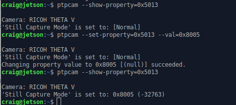

## Setup libptp


### Download libptp source

[libptp - Picture Transfer Protocol lib](https://sourceforge.net/projects/libptp/)

Get the newest version, which is 2-1.2 right now.


### build libptp

```bash
$ ./configure
$ make
```

If you have a build error when compiling libusb, you may need to install the 
development libraries for libusb.


### install libusb-dev

```bash
$ sudo apt install libusb-dev
```

You may not need this step if you already have the libusb development
libraries installed.


Example on x86 Ubuntu 20.04. 

```
$ sudo apt-get install libusb-dev
```


### install libptp

```bash
$ sudo make install
```


On x86 Ubuntu 20.04.

```
$ tar zxvf libptp2-1.2.0.tar.gz 
libptp2-1.2.0/
```

`./configure` ran with no problems  
`make` ran with no problems  
`sudo make install` ran with no problems  

```
$ pwd
/usr/local/lib
$ ls -l libptp2.*
-rw-r--r-- 1 root root 352640 Aug 31 11:54 libptp2.a
-rwxr-xr-x 1 root root    941 Aug 31 11:54 libptp2.la
lrwxrwxrwx 1 root root     16 Aug 31 11:54 libptp2.so -> libptp2.so.1.1.5
lrwxrwxrwx 1 root root     16 Aug 31 11:54 libptp2.so.1 -> libptp2.so.1.1.5
-rwxr-xr-x 1 root root 249352 Aug 31 11:54 libptp2.so.1.1.5
```


### set /usr/local/lib in library path

The default location of the libptp install is `/usr/local/lib`.  
Make sure that this is in your library path.  If it isn't,
add it to a file such as `libc.conf` in `/etc/ld.so.conf/`.

```
$ cd /etc/ld.so.conf.d/
$ ls
$ cat libc.conf
```


### run ldconfig

Load the library configuration.

```
$ sudo /sbin/ldconfig -v
```


On x86 Ubuntu 20.04.

```
$ cd /etc/ld.so.conf.d/
$ l
fakeroot-x86_64-linux-gnu.conf  x86_64-linux-gnu.conf
i386-linux-gnu.conf             zz_i386-biarch-compat.conf
libc.conf
$ cat libc.conf 
# libc default configuration
/usr/local/lib
$ sudo ldconfig
$ 
```

### Test ptpcam

Connect RICOH THETA to Jetson with a USB cable.

Version of 2-1.2 of libptp has a bug in it.  Although
ptpcam does take pictures and function normally,
you will
see an error about capture status.


On x86 Ubuntu.

```
$ ptpcam --info

Camera information
==================
Model: RICOH THETA Z1
  manufacturer: Ricoh Company, Ltd.
  serial number: '10010104'
  device version: 1.50.1
  extension ID: 0x00000006
  extension description: (null)
  extension version: 0x006e

$ cat /proc/cpuinfo 
processor	: 0
vendor_id	: GenuineIntel
cpu family	: 6
model		: 60
model name	: Intel(R) Pentium(R) CPU G3258 @ 3.20GHz
```

### Fix problem with libptp response

Go to line 77 of `ptp.h` and change `PTP_USB_INT_PACKET_LEN` 
to `28`.


After modification, the code will look like this.


## Using USB API

### test ptpcam response again

Take a still image picture with `ptpcam --capture`.


### Set camera to live streaming mode

Check on camera mode.

```
$ ptpcam --show-property=0x5013
```

Set to live streaming mode.

```
$ ptpcam --set-property=0x5013 --val=0x8005
```



Using the official 
[RICOH USB API documentation](https://api.ricoh/docs/theta-usb-api/property/still_capture_mode/), you can verify that
`0x8005` is live streaming mode.  The camera LED should show that
the THETA is in LIVE mode.


In our tests, the RICOH THETA Z1 could charge while streaming
over a USB 3.0 port (blue insert).  

After hours of streaming, the Z1 LED looks like this.


The response codes are shown below.

```
    0x0001 = single-shot shooting
    0x0003 = Interval shooting
    0x8002 = Movie shooting
    0x8003 = Interval composite shooting
    0x8004 = Multi bracket shooting
    0x8005 = Live streaming
    0x8006 = Interval shooting - tripod stabilizatio is off 
             (top/bottom correction and stitching optimized)
    0x8007 = Interval shooting - tripod stabilization is on
```

If you set the camera back to still image, single shot mode,
you will see this response.

```bash
$ ptpcam --set-property=0x5013 --val=0x0001

Camera: RICOH THETA V
'Still Capture Mode' is set to: 0x8005 (-32763)
Changing property value to 0x0001 [(null)] succeeded.
```

### Wake Camera From Sleep

In this test, I have the Z1 power off disabled.  I left the camera
in sleep mode overnight.  When I woke up in the morning,
I work the Z1 up using an ssh session into the Jetson Nano and 
running this command.

```bash
$ ptpcam --set-property=0xD80E --val=0x00

Camera: RICOH THETA Z1
'UNKNOWN' is set to: 1
Changing property value to 0x00 [(null)] succeeded.
```

I tested the camera with the info command.

```bash
$ ptpcam --info

Camera information
==================
Model: RICOH THETA Z1
  manufacturer: Ricoh Company, Ltd.
  serial number: '10010104'
  device version: 1.50.1
  extension ID: 0x00000006
  extension description: (null)
  extension version: 0x006e
```

In my initial tests, I had to run the `info` command twice after
I woke the camera up from sleep. The first time, I could not
open the session.

I got this error.

```bash
$ ptpcam --info
ERROR: Could not open session!
```

In the future, I'll run more tests using the
camera [FunctionalMode](https://api.ricoh/docs/theta-usb-api/property/functional_mode/)
to check status.

### Put Camera in Still Image Mode

You may want to take a detailed picture of the scene based on triggers
from the live stream.

To do this, you need to take the camera out of live streaming mode
and put it into still image mode.  In the example below, I
wrapped ptpcam in a script that explains the hexcode properties
of the mode settings.  This helps me with testing.

```
$ ptpcam --set-property=0x5013 --val=0x0001

Camera: RICOH THETA Z1
'Still Capture Mode' is set to: [Normal]
Changing property value to 0x0001 [(null)] succeeded.

    0x0001 = single-shot shooting
    0x0003 = Interval shooting
    0x8002 = Movie shooting
    0x8003 = Interval composite shooting
    0x8004 = Multi bracket shooting
    0x8005 = Live streaming
    0x8006 = Interval shooting - tripod stabilizatio is off 
             (top/bottom correction and stitching optimized)
    0x8007 = Interval shooting - tripod stabilization is on
```

You can verify the mode of with 0x5013.

```
$ ptpcam --show-property=0x5013

Camera: RICOH THETA Z1
'Still Capture Mode' is set to: [Normal]
```

Compare this with the result when the camera is in live streaming
mode.

```
$ ptpcam --show-property=0x5013

Camera: RICOH THETA Z1
'Still Capture Mode' is set to: 0x8005 (-32763)

    0x0001 = single-shot shooting
    0x0003 = Interval shooting
    0x8002 = Movie shooting
    0x8003 = Interval composite shooting
    0x8004 = Multi bracket shooting
    0x8005 = Live streaming
    0x8006 = Interval shooting - tripod stabilizatio is off 
             (top/bottom correction and stitching optimized)
    0x8007 = Interval shooting - tripod stabilization is on
```

### Start Video Capture

This records video to file. 

```
ptpcam -R 0x101c,0,0,1
```

